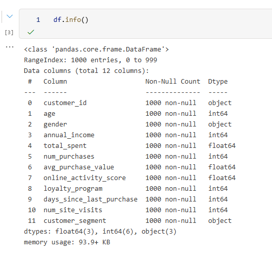
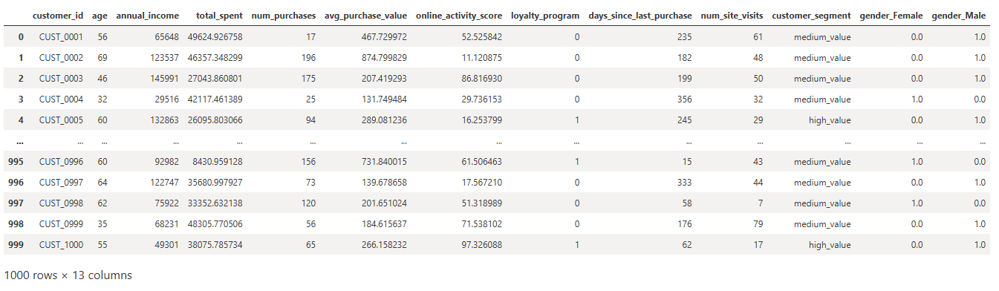
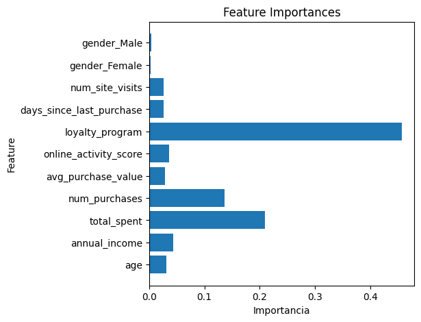
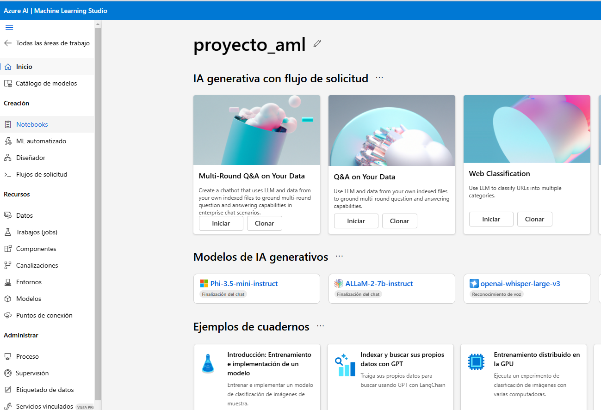
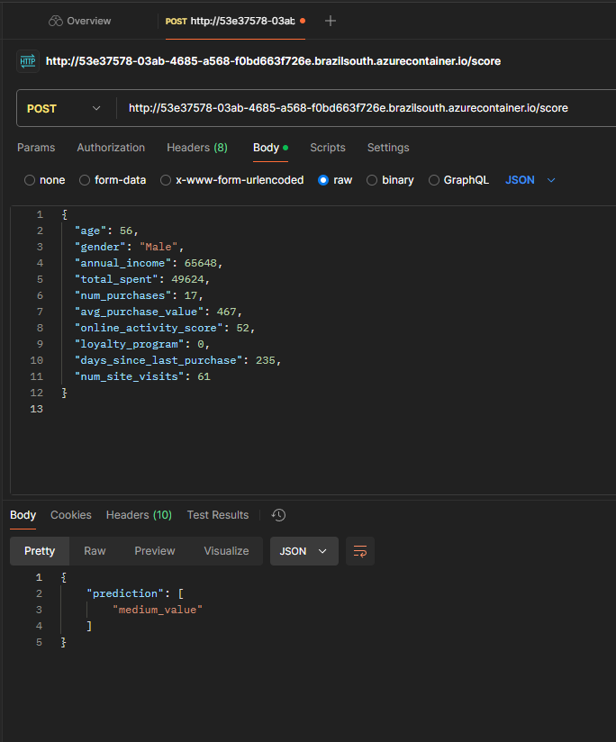
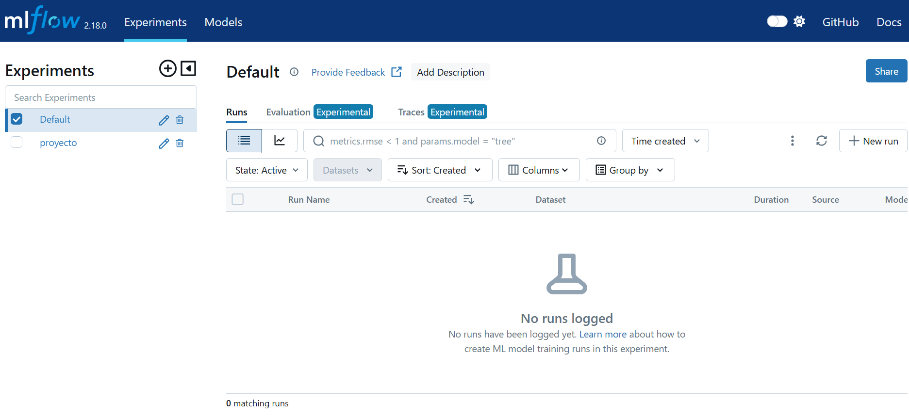
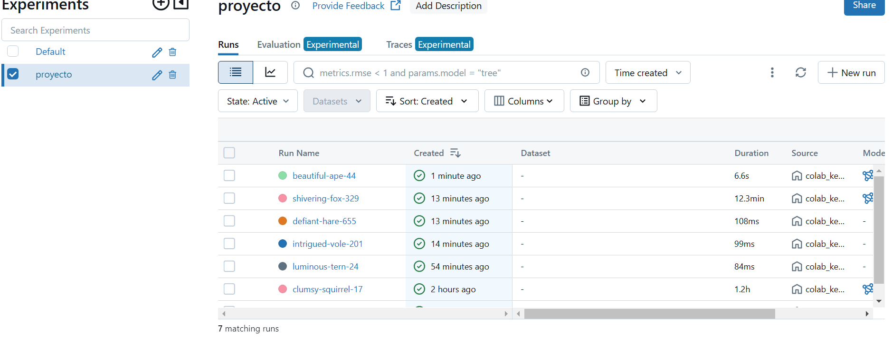
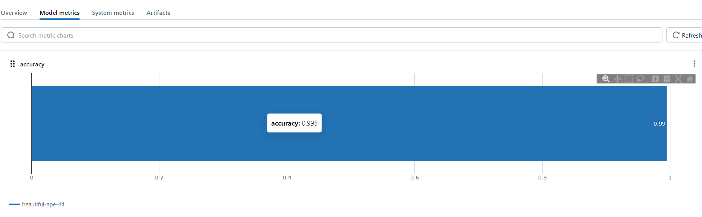

# Despliegue y Monitoreo de un Modelo de Machine Learning para Clasificación de Clientes

<ins>Integrantes</ins>: Tomás Azema Di Pizio, Leonardo Rivadeneira, Priscila Moreno.<br>
<ins>Profesor</ins>: Diego Mosquera<br>
<ins>Materia</ins>: Laboratorio de Minería de Datos<br>
<ins>Comisión</ins>: Martes de 19 a 21 hs<br>
<ins>Instituo</ins>: [ISTEA](https://www.istea.edu.ar/) - Instituto Superior Técnico Empresarial Argentino<br>

<ins>URL de la API</ins>: http://0092feb4-419f-4ffe-b55a-0455af0d5b9b.brazilsouth.azurecontainer.io/score<br>
<ins>Método POST</ins>: Envíar el siguiente código crudo (raw) de JSON
```json
{
  "age": 56,
  "gender": "Male",
  "annual_income": 65648,
  "total_spent": 49624,
  "num_purchases": 17,
  "avg_purchase_value": 467,
  "online_activity_score": 52,
  "loyalty_program": 0,
  "days_since_last_purchase": 235,
  "num_site_visits": 61
}
```


---

### Índice

- [Contexto](#contexto)
- [1. Análisis y preprocesamiento de datos](#1-análisis-y-preprocesamiento-de-datos)
- [2. Entrenamiento del modelo](#2-entrenamiento-del-modelo)
- [3. Empaquetado y despliegue del modelo](#3-empaquetado-y-despliegue-del-modelo)
- [4. Monitoreo y mantenimiento del modelo](#4-monitoreo-y-mantenimiento-del-modelo)

---

### Contexto

Una empresa minorista quiere implementar un sistema de recomendación de productos personalizado. El primer paso es clasificar a los clientes en diferentes categorías (por ejemplo, "alto valor", "frecuente", "ocasional", etc.) basándose en datos históricos de compras y comportamiento de los usuarios. Una vez que se entrena el modelo de clasificación, debe ser desplegado para que el equipo de marketing pueda usarlo en tiempo real.

### 1. Análisis y preprocesamiento de datos

En el marco del contexto explicado en el punto anterior, se analizan los datos existentes en el archivo “*synthetic_customer_data.csv*”. Utilizando un cuaderno de jupyter notebook, en primer lugar se describe la estructura del set de datos:



El **último campo**, llamado *customer_segment*, representa el valor que tiene cada cliente para la empresa, indicado como bajo, medio o alto (low, medium o high). Esta será nuestra variable independiente, es decir, aquella **variable a predecir por el modelo**. Con excepción de *customer_id*, **el resto de columnas serán las columnas de entrada** que recibirá nuestro modelo de machine learning, nuestras variables dependientes.

**Luego de confirmar que no hay valores nulos o filas duplicadas, se procede a realizar una transformación de la columna *gender*. Se transforma la columna de categórica a numerica con** `OneHotEncoder`. Como resultado, se obtienen dos columnas nuevas: una llamada *gender_female* y la otra *gender_male*. A modo de bandera, cuando uno de estos campos contiene un “1” significa que el cliente del registro pertenece a dicho género, y por ende, se anotará un “0” en la otra columna.

Así nos quedaría el conjunto de datos con el cual el modelo será entrenado.



---

### 2. Entrenamiento del modelo

Se divide el set de datos, creándose dos subconjuntos: uno para entrenamiento y el otro para testing, con una proporción de 80 % y 20 % respectivamente. **Se desarrolla un modelo de clasificación de bosque aleatorio**, instanciando a `RandomForestClassifier()` de `scikit-learn`. A continuación, se entrena, se valida y se evalúa el modelo.

**El modelo obtiene muy buenos resultados, destacando un 98% de precisión**. Al revisar y visualizar la importancia de cada “feature” (cada columna o campo en este caso), podemos ver que campo es más importante para el modelo.



**Se procede a hacer una revisión de los hiper parámetros del modelo con el objetivo de mejorar su rendimiento**. En este caso, el modelo utiliza el índice de gini como criterio; **se procede a utilizar el índice de entropía como nuevo criterio** con el fin de obtener mejores resultados, o confirmar si el criterio por defecto ofrece el mejor rendimiento posible. 

**Si bien había poco margen de mejora, el modelo ahora obtiene un 99,5% de precisión**, además de mejorar en otras métricas como el recall o el f1-score.

---

### 3. Empaquetado y despliegue del modelo

Utilizando la librería `joblib`, se serializa y exporta el modelo en un archivo pickle (de extensión .pkl) llamado “*random_forest_model.pkl*”. Este archivo es el que después se utilizará para el despliegue del modelo.

```python
ruta = 'models/random_forest_model.pkl'
joblib.dump(rf_model, ruta)
```

Previo a registrar y desplegar el modelo en Azure, hacemos una API en nuestro cuaderno jupyter notebook (que para nosotros es nuestro área de desarrollo). En el mismo, se utilizará la librería `flask` para crear una API RestFul.

Entre otras cosas, aquí se practicó el hecho de como los datos seran entregados al modelo y devueltos por la API. Por ejemplo, los datos de entrada poseerán al genero como una variable de texto, que deberá ser transformada a dos columnas numéricas por la función de predicción.

#### Creando una instancia de Flask

```python
# Instancia de la aplicación de Flask
app = Flask(__name__)

@app.route("/", methods = ['GET'])
def index():
    return "Método GET de comprobación"

# Define una ruta en el servidor Flask que responde a las solicitudes HTTP POST
@app.route("/predict", methods = ['POST'])

def predict():
    try:
        data = request.get_json(force=True)  # Obtiene los datos del request en formato JSON
        
        if not data:
            return jsonify({'error': 'No data provided'}), 400
        
        # Convertir el género a one-hot encoding
        gender = data['gender']
        gender_female = 1.0 if gender == 'Female' else 0.0
        gender_male = 1.0 if gender == 'Male' else 0.0
        
        # Formatear los datos en el formato que el modelo espera
        features = [
            data['age'], data['annual_income'], data['total_spent'], 
            data['num_purchases'], data['avg_purchase_value'], data['online_activity_score'], 
            data['loyalty_program'], data['days_since_last_purchase'], data['num_site_visits'], 
            gender_female, gender_male
        ]
        
        # Realiza la predicción
        prediction = model.predict([features])
        
        # Devuelve la predicción en formato JSON
        return jsonify({'prediction': prediction.tolist()})
    
    except Exception as e:
        return jsonify({'error': str(e)}), 500

def run_app():
    app.run(host = '0.0.0.0', port = 5000)

thread = Thread(target = run_app)
thread.start()
```

Se realizan dos pruebas y en ambos casos se obtiene un código 200: no solo se obtiene una predicción, sino que también esta misma es “razonable” en base al criterio proporcionado.

```python
url = 'http://127.0.0.1:5000/predict'

usuario_test = {
  "age": 56,
  "gender": "Male",
  "annual_income": 65648,
  "total_spent": 49624,
  "num_purchases": 17,
  "avg_purchase_value": 467,
  "online_activity_score": 52,
  "loyalty_program": 0,
  "days_since_last_purchase": 235,
  "num_site_visits": 61
}

response = requests.post(url, json = usuario_test)

print(response.json())
```

```bash
127.0.0.1 - - [14/Nov/2024 02:13:34] "POST /predict HTTP/1.1" 200 -
{'prediction': ['medium_value']}
```

Concluída esta prueba, ahora si estamos en condiciones de registrar y desplegar el modelo. **Hasta el momento veníamos trabajando en jupyter notebook alojado en Google Colab. Ahora, procederemos a utilizar Azure**, creándose un área de trabajo de Machine Learning (ML Studio o AML) y un grupo de recursos. Se subirán o crearán los archivos necesarios y se creará una instancia de proceso.



Los archivos de programación se utilizarán por separado (en vez de un solo notebook). En todos los archivos, va a ser necesario estar conectado al area de trabajo utilizando la siguiente línea de python: `ws = Workspace.from_config()`.

```
├── 📂 data
│   ├── synthetic_customer_data.csv
├── 📂 models
│   ├── random_forest_model.pkl
├── 📂 scripts
│   ├── despliegue_modelo.py
│   ├── registro_modelo.py
│   ├── score.py
│   ├── test.json
├── noteboook.ipynb
└── run.sh
```

En primer lugar, se ejecutará el archivo “**registro_modelo.py**”, que, como bien indica el nombre, registrará el modelo en el servicio de Azure ML Studio.

```python
from azureml.core import Workspace
from azureml.core.model import Model

# Conectarse al área de trabajo
ws = Workspace.from_config()

# Variables
ruta = "../models/random_forest_model.pkl"
nombre_modelo = 'rf_model'

# Registrar el modelo en el área de trabajo
model = Model.register(workspace = ws,
                       model_name = nombre_modelo,
                       model_path = "../models/random_forest_model.pkl")

# Resultado esperado: "Registering model rf_model"
```

Una vez registrado el modelo, nos aseguraremos de tener el archivo “**score.py**” subido a la plataforma. Aquí dentro es donde desarrollaremos la implementación del modelo y el formato de la entrada de sus parámetros. Es similar al que se encuentra en el notebook, solo que este esta diseñado para su posterior implementación en un punto de conexión de Azure.

```python
from flask import request, jsonify
import joblib
import os

def init():
    global rf_model
    model_path = os.path.join(os.getenv('AZUREML_MODEL_DIR'), 'random_forest_model.pkl')
    rf_model = joblib.load(model_path)

def run(data):
    try:
        data = request.get_json(force=True)

        # Convertir el género a one-hot encoding
        gender = data['gender']
        gender_female = 1.0 if gender == 'Female' else 0.0
        gender_male = 1.0 if gender == 'Male' else 0.0
        
        # Formatear los datos en el formato que el modelo espera
        features = [
            data['age'], data['annual_income'], data['total_spent'], 
            data['num_purchases'], data['avg_purchase_value'], data['online_activity_score'], 
            data['loyalty_program'], data['days_since_last_purchase'], data['num_site_visits'], 
            gender_female, gender_male
        ]
        
        # Realiza la predicción
        result = rf_model.predict([features])
        return jsonify({'prediction': result.tolist()})
        
    except Exception as e:
        error = jsonify({'error': str(e)}), 500
        return error
```

En última instancia, se ejecutará el archivo “**despliegue_modelo.py**”. Este creará nuestro punto de conexión en donde podremos envíar peticiones al modelo para esperar una respuesta. Se define un entorno de `azureml.core.environment` y se agregarán las dependencias necesarias. Se ajustan dos elementos de configuración: `InferenceConfig` y `AciWebservice`.

```python
from azureml.core import Workspace
from registro_modelo import nombre_modelo

# librerias de entorno
from azureml.core.environment import Environment
from azureml.core.conda_dependencies import CondaDependencies
# librerias de despliegue
from azureml.core.model import Model, InferenceConfig
from azureml.core.webservice import AciWebservice, Webservice

# Conectarse al área de trabajo
ws = Workspace.from_config()

# variables
nombre_servicio = 'rf-model-servicio'

# Cargar el modelo
model = Model(ws, nombre_modelo)

# Definir el entorno
env = Environment(name="proyecto_env")
conda_dep = CondaDependencies()
conda_dep.add_conda_package("scikit-learn")
conda_dep.add_conda_package("pandas")
conda_dep.add_conda_package("flask")
env.python.conda_dependencies = conda_dep

env.register(workspace=ws)

# Configurar la inferencia
inference_config = InferenceConfig(entry_script="score.py", environment=env)

# Configurar el despliegue ACI
aci_config = AciWebservice.deploy_configuration(cpu_cores=1, memory_gb=1)

# Desplegar el modelo como un servicio web
service = Model.deploy(ws, nombre_servicio, [model], inference_config=inference_config, deployment_config=aci_config)
service.wait_for_deployment(show_output=True)
print(service.state)

uri = service.scoring_uri
print(f'Dirección URI a la cual enviar las peticiones: {uri}')

```

**Se realizaron pruebas y comprobaciones finales utilizando el servicio de [Postman](https://www.postman.com/)**. Se le pasó la URL generada por Azure para envíar peticiones, y una petición como prueba.

Se obtuvo como resultado un código 200, indicando que no hubo errores en el transcurso. El valor devuelto es una predicción, con el segmento del cliente como resultado.



---

### 4. Monitoreo y mantenimiento del modelo

En esta etapa del proyecto se implementa el seguimiento y la gestión del modelo utilizando **MLflow**. Para permitir el acceso remoto a la interfaz de usuario de MLflow, se utiliza un túnel seguro configurado con **ngrok**.

#### <ins>Bibliotecas Utilizadas</ins>

Se instalan mlflow y pyngrok para el seguimiento de modelos de aprendizaje automático, el registro de modelos y la implementación.

```python
!pip install mlflow
!pip install pyngrok
```

Ahora si, se importan las librerías.

```python
import mlflow
import mlflow.sklearn
from sklearn.model_selection import train_test_split
from sklearn.ensemble import RandomForestClassifier
from sklearn.metrics import accuracy_score
```

#### <ins>Configuración de MLflow</ins>

```python
# Se establece el modelo en MLflow
mlflow.set_experiment('proyecto')

# Esta línea es importante para asegurar que no haya ejecuciones activas antes de comenzar una nueva.

if mlflow.active_run() is not None: 
    mlflow.end_run()
```

#### <ins>Entrenamiento y registro del modelo</ins>

```python
with mlflow.start_run()
    # Define y entrenae el modelo
    rf_model = RandomForestClassifier(n_estimators=10)
    rf_model.fit(X_train, y_train)

    mlflow.log_param("n_estimators", 10)
```

```python
y_pred = rf_model.predict(X_test)
accuracy = accuracy_score(y_test, y_pred)

# Serializando el modelo
mlflow.sklearn.log_model(rf_model, "RandomForestModel")
```

#### <ins>Configuración y ejecución de ngrok</ins>

```python
# Activando el servidor
get_ipython().system_raw("mlflow ui --port 5000 &")
```

```python
from pyngrok import ngrok

ngrok.kill()

NGROK_AUTH_TOKEN = "2p2khEow4fR9Jyb9mIIWfDwPFj4_7hFMxUFE2PXQBCBRNxcL3"
ngrok.set_auth_token(NGROK_AUTH_TOKEN)

ngrok_tunnel = ngrok.connect(addr="5000", proto="http", bind_tls=True)

print("Url para MLFLOW: ", ngrok_tunnel.public_url)
```







---

[🏠 Ir al inicio](#despliegue-y-monitoreo-de-un-modelo-de-machine-learning-para-clasificación-de-clientes)